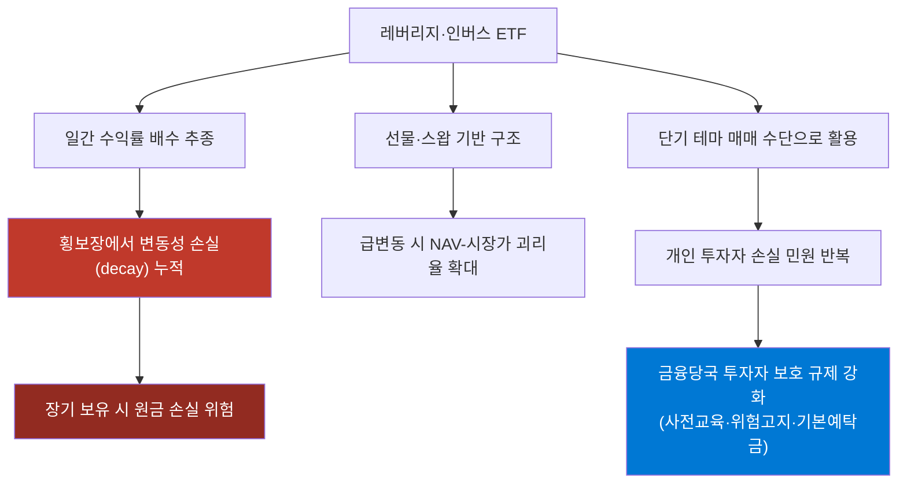

# ETF 심화 (일반펀드 vs ETF 비교)

> **모듈 8: 퀀트를 위한 금융 필수 지식** | 🏦

---

> 📺 **YouTube 강의**: [🎬 ETF 심화 일반펀드 ETF 차이](https://www.youtube.com/results?search_query=ETF+일반펀드+차이+실습+한국어)
>


## 오늘 배울 것

- 일반펀드와 ETF의 구조 차이
- 비용(보수·수수료·스프레드) 비교 방법
- 유동성·추적오차·괴리율 체크 방법
- 실습: 동일 자산군에서 일반펀드 vs ETF 비교 리포트

---

## 일반펀드 vs ETF 비교 프레임

| 항목 | 일반펀드 | ETF |
|---|---|---|
| 거래 방식 | 기준가 기반 신청/환매 | 거래소 실시간 매매 |
| 가격 반영 | 하루 1회 중심 | 장중 실시간 |
| 비용 구조 | 판매보수/운용보수 중심 | 총보수 + 매매비용(수수료/스프레드) |
| 정보 투명성 | 운용 보고서 주기 공시 | 지수/구성종목 비교적 즉시 확인 |
| 적합한 투자자 | 자동적립·장기 유지 중심 | 직접 매매·리밸런싱 중심 |

### 실전 체크리스트
1. 총보수(TER)와 최근 추적오차
2. 일평균 거래대금, 호가 스프레드
3. 계좌 목적(연금/일반)과 매매 빈도

---

## 실습: 비교 점수 계산 예시

```python
products = [
    {"name": "일반펀드A", "ter": 0.95, "spread": 0.00, "liquidity": 1.0},
    {"name": "ETF_B", "ter": 0.20, "spread": 0.08, "liquidity": 4.5},
]

for p in products:
    cost_score = max(0, 10 - p["ter"] * 5 - p["spread"] * 10)
    liq_score = min(10, p["liquidity"] * 2)
    total = round(cost_score * 0.6 + liq_score * 0.4, 2)
    print(p["name"], total)
```

---

## 해보기 활동

1. 같은 지수를 추종하는 일반펀드 1개와 ETF 1개를 골라 총비용을 비교해보세요.
2. ETF의 일평균 거래대금과 호가 스프레드를 확인해 체결 리스크를 설명해보세요.
3. 자신의 투자 스타일(자동적립/직접매매)에 맞는 상품을 선택하고 이유를 써보세요.

---

## 레버리지·인버스 ETF — 구조적 문제점과 최근 논란

> 📖 **Wikipedia**: [레버리지 ETF](https://en.wikipedia.org/wiki/Leveraged_exchange-traded_fund) · [ETN](https://ko.wikipedia.org/wiki/상장지수증권)

일반 ETF와 달리 **레버리지·인버스 ETF**는 국내에서 반복적으로 투자자 피해와 금융당국 규제 이슈가 제기되어 온 상품군입니다. 구조를 정확히 이해하지 못하고 "지수가 오를 것 같으니 2배로 벌자"는 식으로 접근하면 예상과 전혀 다른 결과를 얻기 쉽습니다.

### 1) 레버리지·인버스 ETF란?

| 유형 | 추종 방식 | 예시(국내) |
|---|---|---|
| **레버리지(2X)** | 기초지수의 **일간** 수익률의 +2배 | KODEX 레버리지, TIGER 200 레버리지 |
| **인버스(-1X)** | 기초지수의 **일간** 수익률의 -1배 | KODEX 인버스 |
| **곱버스(인버스 2X)** | 기초지수의 **일간** 수익률의 -2배 | KODEX 200선물인버스2X |

> ⚠️ 핵심은 "**일간(daily)**" 수익률을 추종한다는 점입니다. 연 단위·월 단위 누적 수익률의 2배가 아니라, **매일매일 수익률을 2배로 재조정(리밸런싱)** 합니다.

### 2) 가장 흔히 제기되는 문제 — 음의 복리효과(Volatility Decay)

지수가 오르락내리락을 반복하며 결국 원래 자리로 돌아와도, 레버리지·인버스 ETF는 매일 재조정되는 구조 때문에 **원금 손실이 누적**될 수 있습니다.

```python
# 변동성 손실(음의 복리효과) 시뮬레이션
base = 100.0
lev  = 100.0  # 2배 레버리지 ETF 가정
daily_returns = [0.10, -0.10, 0.10, -0.10]  # 기초지수가 +10%/-10%를 반복

for r in daily_returns:
    base *= (1 + r)
    lev  *= (1 + 2 * r)

print(f"기초지수 4일 후: {base:.2f} (원금 대비 {base-100:.2f}%)")
print(f"2배 레버리지 4일 후: {lev:.2f} (원금 대비 {lev-100:.2f}%)")
# 기초지수는 -1.99%인데, 2배 레버리지는 -7.84%까지 벌어짐 (변동성이 클수록 격차 확대)
```

| 구분 | 4일 후 결과(예시) | 해석 |
|---|---|---|
| 기초지수 | 약 -1.99% | 단순 등락 반복으로 소폭 손실 |
| 2배 레버리지 ETF | 약 -7.84% | 변동성 때문에 손실이 지수의 2배를 훨씬 초과 |

**핵심 결론**: 변동성이 큰 횡보장(박스권)에서 레버리지·인버스 ETF를 장기 보유하면, 기초지수가 제자리여도 손실만 누적되는 경우가 많습니다. 그래서 이 상품군은 구조적으로 **단기 매매용**으로 설계되어 있고, 장기 보유에는 적합하지 않다고 평가됩니다.

### 3) 국내에서 반복적으로 불거진 논란

- **개인 투자자 쏠림 현상**: 국내 코스피200 선물 레버리지·인버스 ETF는 개인 투자자 거래 비중이 매우 높은 상품군으로 꼽혀 왔고, 단기 방향성 베팅(테마성 매매) 수단으로 활용되면서 손실 민원이 반복적으로 발생했습니다.
- **서학개미의 해외 3배 레버리지 ETF 집중**: 미국 상장 3배 레버리지 ETF(반도체·나스닥 추종 등)에 국내 개인 자금이 대거 몰리면서, 변동성 손실 위험이 큰 상품에 과도하게 집중된다는 지적이 금융당국·언론에서 꾸준히 제기되어 왔습니다.
- **괴리율·유동성 공급(LP) 이슈**: 레버리지·인버스 ETF는 기초자산이 선물이거나 스왑 계약인 경우가 많아, 시장 급변동 시 유동성공급자(LP)의 호가 제공이 일시적으로 지연되면서 **순자산가치(NAV)와 시장가격 간 괴리율**이 커지는 사례가 반복돼 왔습니다.
- **투자자 보호 강화 조치**: 이런 이슈들로 인해 금융당국은 레버리지·인버스 ETF에 대해 **사전 교육 이수, 위험고지 강화, 기본예탁금 제도** 등 일반 ETF보다 엄격한 투자자 보호 장치를 적용하고 있습니다.



### 4) 투자 시 체크리스트

1. **보유 기간을 며칠~몇 주 이내로 제한**한다 — 장기 보유 목적이라면 레버리지가 아닌 일반 ETF를 선택합니다.
2. **변동성이 큰 구간**(횡보장, 뉴스 이벤트 전후)에서는 음의 복리효과가 더 크게 나타난다는 점을 인지합니다.
3. 실제 보유 중인 상품의 **NAV 대비 시장가 괴리율**을 주기적으로 확인합니다.
4. "지수가 그대로면 손실도 없다"는 가정은 레버리지·인버스 상품에는 적용되지 않는다는 점을 항상 기억합니다.

---

# 📊 국내 주식 거래 수수료와 세금 기준

## 1. [거래소 수수료](ca://s?q=거래소_수수료_기준)
- 코스피·코스닥: 약 0.0036%  
- 코넥스: 약 0.01%  
- 투자자가 직접 내는 것이 아니라 증권사가 대신 납부하며 전체 수수료에 포함됨.

## 2. [증권사 수수료](ca://s?q=증권사_수수료_기준)
- 기본: 약 0.015%  
- 비대면 계좌 개설 이벤트: 사실상 무료 (0.003~0.004% 수준 최소 비용)  
- 예시: 1천만 원 거래 시 약 1,500원 발생.

## 3. [증권거래세](ca://s?q=증권거래세_기준)
- 코스피·코스닥: 0.15% (2025년 기준, 농특세 포함)  
- 코넥스: 0.10%  
- 장외시장(K-OTC): 0.25%  
- 매도 시에만 부과되며, 손실을 보더라도 반드시 납부해야 함.

## 4. [농어촌특별세](ca://s?q=농어촌특별세_기준)
- 코스피 매도 시 증권거래세 외에 0.15% 추가 부과  
- 따라서 코스피 매도 시 총 0.35% 부담.

## 5. [양도소득세](ca://s?q=양도소득세_대주주_기준)
- 일반 개인 투자자는 해당 없음.  
- 대주주 기준:  
  - 코스피: 1% 이상 또는 50억 원 이상 보유  
  - 코스닥: 2% 이상 또는 50억 원 이상 보유  
- 세율:  
  - 과세표준 3억 원 이하: 22%  
  - 3억 원 초과: 27.5% (지방소득세 포함).

## 6. [배당소득세](ca://s?q=배당소득세_기준)
- 배당금 지급 시 원천징수  
- 세율: 15.4% (소득세 14% + 지방소득세 1.4%)  
- 연간 금융소득 2,000만 원 초과 시 종합소득세(6.6~49.5%) 추가.

---

## 📌 요약 비교표

| 구분 | 세율/비용 | 적용 시점 |
|------|-----------|-----------|
| [거래소 수수료](ca://s?q=거래소_수수료_기준) | 코스피·코스닥 0.0036% | 매수·매도 시 |
| [증권사 수수료](ca://s?q=증권사_수수료_기준) | 약 0.015% (이벤트 시 무료) | 매수·매도 시 |
| [증권거래세](ca://s?q=증권거래세_기준) | 코스피·코스닥 0.15% | 매도 시 |
| [농어촌특별세](ca://s?q=농어촌특별세_기준) | 코스피 0.15% | 매도 시 |
| [양도소득세](ca://s?q=양도소득세_대주주_기준) | 22~27.5% (대주주만) | 매도 차익 발생 시 |
| [배당소득세](ca://s?q=배당소득세_기준) | 15.4% | 배당금 지급 시 |

---

## 💡 투자자가 알아야 할 핵심 팁
- [비대면 계좌 이벤트](ca://s?q=비대면_계좌_개설_이벤트) 활용 시 수수료 절감 효과 큼  
- [코스피 매도](ca://s?q=코스피_매도_세금) 시 농특세 추가 확인 필요  
- [단타매매](ca://s?q=단타매매_비용_부담) 시 거래 비용 급증  
- [ISA·연금계좌](ca://s?q=ISA_연금계좌_절세) 활용으로 절세 가능

---

# 🌍 해외 주식 거래 수수료와 세금 기준

## 1. [거래 수수료](ca://s?q=해외_주식_거래_수수료)
- 증권사별로 0.2~0.3% 수준 (국내보다 높음)  
- 일부 증권사는 이벤트로 할인 제공  
- 미국 기준: SEC 수수료는 2025년 이후 면제, FINRA TAF는 매도 시 주당 약 0.000166달러(최대 8.30달러)

## 2. [환전 수수료](ca://s?q=해외_주식_환전_수수료)
- 0.2~0.3% 수준 (증권사별 차이)  
- 환전우대 이벤트 활용 시 최대 90% 할인 가능  
- 달러 RP 계좌, 미리 환전 전략으로 절감 가능

## 3. [양도소득세](ca://s?q=해외_주식_양도소득세)
- 모든 투자자 과세 대상  
- 연간 순이익에서 250만 원 공제 후 22% 과세 (지방소득세 포함)  
- 다음 해 5월 종합소득세 신고·납부 필요  
- 손실 이월 불가, 동일 과세기간 내 통산만 가능

## 4. [배당소득세](ca://s?q=해외_주식_배당소득세)
- 미국 배당금: 현지에서 15% 원천징수  
- 한국에서 종합과세 신고 시 외국납부세액공제 적용 가능 → 이중과세 방지  
- 국가별 조세조약에 따라 세율 상이

## 5. [ETF/ETN 과세](ca://s?q=해외_ETF_세금)
- 국내 ETF: 거래세 부과  
- 해외 ETF: 증권거래세 없음, 대신 양도소득세 22% (250만 원 공제 후)

---

## 📌 요약 비교표

| 구분 | 세율/비용 | 적용 시점 |
|------|-----------|-----------|
| [거래 수수료](ca://s?q=해외_주식_거래_수수료) | 0.2~0.3% (증권사별) | 매수·매도 시 |
| [환전 수수료](ca://s?q=해외_주식_환전_수수료) | 0.2~0.3% | 환전 시 |
| [양도소득세](ca://s?q=해외_주식_양도소득세) | 22% (250만 원 공제 후) | 매도 차익 발생 시 |
| [배당소득세](ca://s?q=해외_주식_배당소득세) | 현지 원천징수 + 국내 종합과세 | 배당금 지급 시 |
| [ETF/ETN](ca://s?q=해외_ETF_세금) | 해외 ETF는 양도소득세 22% | 매도 시 |

---

## 💡 투자자가 알아야 할 핵심 팁
- [해외 주식은 무조건 신고 의무](ca://s?q=해외_주식_종합소득세_신고): 5월 종합소득세 신고 필수  
- [환전 비용 관리](ca://s?q=해외_주식_환전_비용_절감): 환전우대 이벤트 적극 활용  
- [외국납부세액공제](ca://s?q=외국납부세액공제_배당소득): 배당소득 이중과세 방지  
- [ISA·연금계좌](ca://s?q=ISA_연금계좌_해외_주식_절세) 활용으로 절세 가능

---

# 주식 관련 세계의 유명한 석학

주식과 투자 이론의 기틀을 닦고 시장을 분석해 온 세계적인 석학들은 크게 **학문적 이론을 정립한 경제·재무학자**와 **수학·과학적 모델을 시장에 접목한 천재 과학자**들로 나눌 수 있습니다. 

단순히 감에 의존하는 투자가 아닌, 데이터와 이론으로 금융 시장의 패러다임을 바꾼 대표적인 석학들을 정리해 드립니다.

---

## 1. 현대 투자 이론의 기틀을 닦은 경제·재무학자

| 석학 이름 | 대표 업적 및 이론 | 핵심 개념 |
| :--- | :--- | :--- |
| **벤저민 그레이엄**<br>*(Benjamin Graham)* | 가치투자의 아버지 | 기업의 실제 가치보다 주가가 낮을 때 매수하는 **'안전마진(Margin of Safety)'** 개념을 정립하여 워런 버핏 등의 제자를 양성했습니다. |
| **해리 마코위츠**<br>*(Harry Markowitz)* | 현대 포트폴리오 이론 (MPT) | "달걀을 한 바구니에 담지 마라"는 격언을 수학적으로 증명해 냈습니다. 자산 배분을 통해 위험을 줄이고 수익을 극대화하는 법을 정립하여 노벨 경제학상을 받았습니다. |
| **유진 파마**<br>*(Eugene Fama)* | 효율적 시장 가설 (EMH) | 주식시장의 가격은 이미 이용 가능한 모든 정보를 즉각 반영하고 있다는 이론입니다. 이 이론은 훗날 개인 투자자들이 시장 평균을 추종하는 **인덱스 펀드(ETF)**가 탄생하는 이론적 배경이 되었습니다. |
| **로버트 실러**<br>*(Robert Shiller)* | 행동경제학 및 자산 가격 버블 연구 | 인간의 심리가 시장에 미치는 영향을 분석했습니다. 주가가 기업 가치에 비해 얼마나 고평가되었는지 측정하는 **'CAPE 지수(실러 PER)'**를 개발하여 닷컴 버블과 서브프라임 모기지 사태를 예측했습니다. |

---

## 2. 시장을 공식으로 풀어낸 수학·물리학 석학 (퀀트의 시조)

현대 주식시장에서 컴퓨터 알고리즘과 데이터 분석으로 투자하는 **'퀀트(Quant) 투자'**를 개척한 석학들입니다.

* **짐 사이먼스 (James Simons):** 세계적인 수학자이자 헤지펀드 '르네상스 테크놀로지'의 설립자입니다. 금융 데이터 뒤에 숨겨진 패턴을 수학적 모델로 찾아내어, 그가 이끈 메달리온 펀드는 30년 넘게 연평균 약 66%(수수료 차감 전)라는 경이적인 수익률을 기록했습니다.
* **에드워드 소프 (Edward Thorp):** MIT 수학 교수 출신으로 '퀀트의 아버지'라 불립니다. 확률 이론을 바탕으로 라스베이거스 카지노의 블랙잭 이기는 법을 개발한 뒤, 주식시장으로 넘어와 최초의 컴퓨터 알고리즘 기반 헤지펀드를 운용하며 시장을 지배했습니다.
* **피셔 블랙 & 마이런 숄즈 (Fisher Black & Myron Scholes):** 물리학과 경제학을 접목해 옵션 등 파생상품의 적정 가격을 계산하는 **'블랙-숄즈 모형'**을 만들었습니다. 이 공식의 정립으로 현대 금융공학이라는 학문이 탄생하게 되었습니다.

---

> 💡 **흥미로운 사실:** > 거시경제학의 거두인 **존 메이너드 케인스**는 이론뿐만 아니라 실제 주식 투자에서도 연평균 16%에 달하는 엄청난 수익을 올린 탁월한 투자자였습니다. 반면, 만유인력의 법칙을 발견한 천재 물리학자 **아이작 뉴턴**은 "천체의 움직임은 계산할 수 있어도, 인간의 광기는 계산할 수 없다"는 유명한 말을 남기며 주식 투기(남해회사 사건)로 전 재산을 날리기도 했습니다.

---

# 📊 GitHub 주식 투자 관련 레포지토리

GitHub에는 주식 투자와 관련된 인기 오픈소스 프로젝트들이 다수 있으며,  
백테스트, 포트폴리오 최적화, 데이터 분석, 알고리즘 트레이딩 등 다양한 기능을 제공합니다.  
대표적으로 `ghostfolio`, `backtesting.py`, `PyPortfolioOpt` 같은 레포지토리가 많이 활용됩니다.

---

## 주요 레포지토리

| **레포지토리** | **설명** | **스타 수** |
|---|---|---|
| **ghostfolio** | 오픈소스 자산 관리 소프트웨어. Angular + NestJS 기반으로 개인 포트폴리오 관리 가능 | ⭐ 8.5k |
| **backtesting.py** | 파이썬 기반 트레이딩 전략 백테스트 프레임워크 | ⭐ 8.4k |
| **PyPortfolioOpt** | 포트폴리오 최적화 라이브러리 (효율적 투자선, Black-Litterman 등) | ⭐ 5.7k |
| **FinanceToolkit** | 재무 데이터 분석 및 주식 지표 계산 툴킷 | ⭐ 4.8k |
| **mlfinlab** | 머신러닝 기반 금융 데이터 분석 툴 | ⭐ 4.8k |
| **awesome-investing** | 투자 및 금융 관련 리소스 모음집 | ⭐ 2.4k |
| **investpy** | Investing.com 데이터 추출 API (파이썬) | ⭐ 1.8k |
| **NextTrade** | 알고리즘 트레이딩 시스템 | ⭐ 1.8k |

---

## 추가 인기 레포지토리

- **Qlib**: AI 기반 퀀트 투자 플랫폼 (MSRA 개발)  
- **FinRL**: 강화학습 기반 금융 트레이딩 프레임워크  
- **Stocksight**: 뉴스/트위터 감성 분석을 통한 주식 예측  
- **TradeMaster**: 강화학습 기반 퀀트 트레이딩 플랫폼  

---

# 🎢 VIX(공포지수) 계산 원리

VIX(변동성지수)의 원리를 대형 주식시장 대신, 우리가 잘 아는 **‘놀이공원 우비 가게’** 예시로 생각하면 아주 쉽습니다.

---

## 🌦️ 놀이공원의 우비 가게 이야기

날씨가 맑을지, 비가 올지, 아니면 갑자기 태풍이 불지 알 수 없는 이상한 날씨의 놀이공원이 있습니다. 이 놀이공원 앞에는 **우비를 파는 가게**가 하나 있어요.

* **날씨가 아주 맑고 평화로울 때 ☀️**
  - 사람들은 비가 올 걱정을 전혀 하지 않습니다. 우비를 사려는 사람이 없으니 우비 가격은 **1,000원**으로 아주 쌉니다.
* **하늘에 먹구름이 끼고 태풍이 올 것 같을 때 ⛈️**
  - 사람들은 옷이 젖을까 봐 무서워져서 너도나도 우비를 사려고 길게 줄을 냅니다. 우비 가격은 순식간에 **10,000원**으로 폭등합니다.

여기서 우리는 하늘을 직접 보지 않아도, **우비 가격이 치솟는 것을 보고 "아, 지금 사람들이 날씨가 엄청 나빠질 거라고 예상하고 무서워하는구나!"**라는 걸 눈치챌 수 있습니다.

---

## 📉 주식시장과 VIX 연결하기

이 원리를 주식시장에 그대로 가져온 것이 바로 **VIX**입니다.

* **놀이공원 날씨** = 주식시장의 상황 (주가가 평화로울지, 폭락할지)
* **우비** = 옵션 (주가가 떨어질 때를 대비해 투자자들이 드는 **'보험'**)
* **우비 가격** = 옵션 가격 (보험료)
* **우비 가격을 보고 맞춘 '동네의 공포 수준'** = **VIX 지수**

---

## 👀 3단계로 정리하는 VIX 계산 프로세스

1. **사람들의 불안감 감지**
   - 주식시장이 앞으로 불안해질 것 같으면, 투자자들은 손해를 보기 싫어서 '보험(옵션)'을 비싼 돈을 주고서라도 막 사기 시작합니다.
2. **보험료 실시간 확인**
   - 컴퓨터(시카고옵션거래소)가 지금 주식시장에서 사람들이 사고파는 **보험들의 가격이 얼마인지 실시간으로 전부 조사**합니다.
3. **공포 점수(VIX) 매기기**
   - 보험 가격이 비싸면 비쌀수록 **"아하, 사람들이 한 달 뒤에 엄청난 폭풍(주가 변동)이 올 거라고 믿고 무서워하는구나!"** 하고 점수를 높게 매깁니다. 이 점수가 바로 VIX입니다.

> 📌 **한 줄 요약**
> VIX는 과거에 주가가 얼마나 움직였는지 계산하는 게 아니라, **"지금 사람들이 미래의 위험에 대비해 보험료(옵션 가격)를 얼마나 많이 내고 있는지"**를 보고 시장의 무서움을 점수로 나타낸 것입니다!
