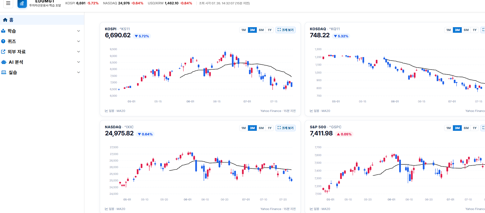
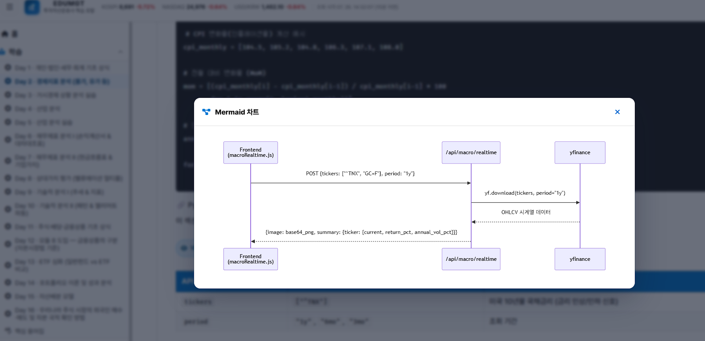
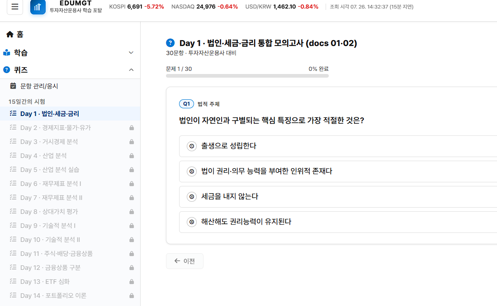

<link rel="stylesheet" href="https://cdnjs.cloudflare.com/ajax/libs/font-awesome/6.5.2/css/all.min.css" />

## 금융자산 knowledge 를 취업 목적으로 serving 시스템 만드는 과정
### 본 과정은 수료 후 취업 또는 개인창업이 목표 이므로, 개인별로 하루 10k byte 이상의 knowledge 또는 PL 소스를 생산하는 것을 목표로 하고, 해당 증적은 모두 github , CSP 등의 플랫폼에 적재한다. 

## 수업 진행 방식
### 오전 첫타임 : 스크럼회의, 질의응답, 전날 수업 내용 개인별 복습, 당일 사용 플랫폼 리소스 셋팅
### 오후 식사 후 첫타임 : 식후 피로도를 고려하여 개인별 실습
### 오후 수업 종료전 막타임 : 당일 수업 내용의 NotebookLM 에 콘텐츠 Knowledge 구성, 당일 사용 리소스 삭제(클라우드 등) 
### 개별 실습 시간에는 유선 이어폰 (되도록 라인 긴) 으로 각자 시청각 볼때 사용 합니다.
### http://iv.edumgt.co.kr 의 학습사이트를 이용 합니다.








## 수업시 상호 호혜원칙
### 본 수업은 사인간의 교육 형식 업무로 다음과 같은 업무 방해시 강사는 수업을 중단, 해소될때 까지 학원에 건의 및 해소되면 재기합니다.

### 다음 1. 본 수업과 관계 없는 질문, 본 수업 일정과 다른 질문으로 업무 방해
### 다음 2. 첫타임, 막타임의 질의 응답 시간을 활용해도 될 질문을 수업중간 끼어들기로 질의 할 경우
### 다음 3. 수업 중 잡담, 수면, 코를 고는 등의 전체 참여자에게 불쾌함을 주는 행동등 상호 존중을 못하는 경우
### 단, 수업 중 주식 창 보는 건 허용 합니다.

## AI 플랫폼, 클라우드 등의 사용료
### 월별 30만원 이상의 플랫폼 사용료가 별도로 필요 합니다.
### 해당 사업비의 조달을 개인별로 계획하시기 바랍니다.

## 개발 방법론
### 본 과정은 AI 기반의 개발로 일체 코딩 없이 CLI 기반으로 진행 합니다.
### 실제 ML/DL 리소스는 클라우드의 리소스로 대체 됩니다. 
### 모든 작업은 개인별 Codex 또는 Claude Code 에이전트를 통해 작업 합니다.

---


### 본 저장소의 `docs/` 폴더에 Vector DB 구축을 위한 RAG 용 자산운용 관련 내용이 있습니다.

- 이 내용은 전공여부, 본인의 지식, 경험여부와 무관하게, 자산운용 시스템을 만들기 위한 자료 입니다.
- 따라서, 쉬운 기초 내용 위주로 계속 문서를 보완 추가하면서, 차후 시스템 개발의 지식 배경을 목적으로 하며,
- 각자 이 repo 를 fork 하고, 별도 본인 repo 를 만들어 계속 본인의 repo 에 md 포맷으로 knowledge 를 축적합니다.

#### 본인의 경력, 실력과 상관없이 수업중 자신의 스케쥴대로 독립적인 연구를 할 수 있으며, 단, 수업에 방해되지 않게 해야합니다.
#### md 파일별로 각종 youtube 등의 링크가 있으므로, 헤드셋을 준비하여 개인 실습 시간에 이용 합니다.

### <i class="fa-solid fa-compass"></i> 시작 전 개인 준비 가이드 (필수)

이 저장소를 실제로 진행하려면, 각자 역할과 목표에 맞춰 아래 항목을 먼저 준비해야 합니다.

#### 1) 개인별 습득 기술 스택

| 구분 | 우선 습득 스택 | 이 repo에서 바로 쓰는 영역 |
|------|----------------|-----------------------------|
| 공통(전원) | Git/GitHub, Markdown, 기본 Linux 명령어, HTTP/REST, JSON, `.env` 관리 | 문서 누적, 협업, API 호출, 환경변수 세팅 |
| PM/PMO/QA | 스크럼 운영, 이슈/체크리스트 관리, 테스트 시나리오 작성, 배포 검증 | 일정관리, 산출물 검수, 릴리즈 품질 확인 |
| PL | FastAPI 구조, 프론트-백 연동 구조, API 명세 관리 | `app/backend/main.py`, `app/frontend/js/views/*` |
| Architect | Docker, Docker Compose, AWS ECR/EC2, GitHub Actions | `Dockerfile`, `docker-compose.yml`, `.github/workflows/deploy-ecr-ec2.yml` |
| Pipe Liner (RAG/DB) | MongoDB, Qdrant(Vector DB), 데이터 전처리/청킹, Python 스크립팅 | `scripts/upload_docs_to_qdrant.sh`, `scripts/init_quiz_mongodb.sh` |
| 개발자(자동화 중심) | Python 데이터 처리(`pandas`, `numpy`), 시각화, ML 기본(`scikit-learn`), API 디버깅 | `requirements.txt`, `app/src/*`, 백엔드 분석 API |

#### 2) 개인 PC 사양 (최소/권장)

| 항목 | 최소 사양(학습/문서 위주) | 권장 사양(로컬 실습 + Docker) |
|------|--------------------------|------------------------------|
| OS | Windows 11 / macOS 12+ / Ubuntu 22.04+ | Windows 11(WSL2 권장) / Ubuntu 22.04+ / macOS 14+ |
| CPU | 4코어 | 8코어 이상 |
| RAM | 16GB | 32GB 이상 |
| 저장공간 | 여유 30GB | 여유 80GB 이상(NVMe 권장) |
| 네트워크 | 가정용 브로드밴드 | 안정적 유선망 + 업로드 여유 |
| 필수 소프트웨어 | Python 3.10+, Git, VS Code | + Docker Engine/Compose, Postman/Insomnia |

> 딥러닝(`torch`, `transformers`, `diffusers`)까지 로컬에서 본격 실행하면 메모리/저장공간 요구가 커질 수 있으므로, 부족하면 클라우드(AWS EC2)로 분리 운영을 권장합니다.

#### 3) 가입해야 할 플랫폼 (필수/권장)

| 구분 | 플랫폼 | 용도 | 가입/키 |
|------|--------|------|--------|
| 필수 | GitHub | 코드 협업, Fork/PR, Actions 확인 | 가입 필수 |
| 필수 | DART Open API | 기업 공시/재무 데이터 조회 | API 키 발급 필요 (`DART_API_KEY`) |
| 필수 | 한국은행 ECOS | 금리/거시 지표 조회 | API 키 발급 필요 (`BOK_API_KEY`) |
| 권장 | FRED | 미국 거시지표 조회 | API 키 권장 (`FRED_API_KEY`) |
| 권장 | KRX Data Marketplace | 국내 시장 데이터 | API 키 권장 (`KRX_API_KEY`) |
| 권장 | TradingView / Investing.com | 차트/지표 검증 | 가입 권장 |
| 배포 시 필수 | AWS (ECR/EC2) | 컨테이너 배포, 운영 | 결제수단 등록 필요 |

#### 4) 예상 비용 (카드 청구 예상금액, 월 기준)

> 아래는 **1인 기준 추정치**이며, 실제 과금은 사용량/리전/서버 스펙에 따라 달라집니다.  
> 기본 가정은 **AWS ap-northeast-2(서울) 리전의 일반적인 소규모 사용 패턴**입니다.

| 시나리오 | 월 예상 비용(1인) | 구성 예시 |
|----------|------------------|-----------|
| 최소(로컬 학습 중심) | **₩0 ~ ₩30,000** | 로컬 실행 + 무료 API 위주 + 도메인/유료툴 미사용 |
| 권장(팀 개발/간헐 배포) | **₩30,000 ~ ₩120,000** | EC2 소형 인스턴스 + ECR/스토리지 소량 + 데이터 전송 소량 |
| 운영(상시 배포/실습 다수) | **₩120,000 ~ ₩300,000+** | 상시 서버 + 컨테이너 이미지 다수 + 트래픽 증가 |

추가로 발생할 수 있는 비용:
- 클라우드 GPU 실습(선택): 사용 시간에 따라 월 수만원~수십만원
- 유료 데이터/리서치 도구(선택): 서비스별 구독료 별도
- 팀 공용 인프라 사용 시 비용을 팀원 수(`N`)로 균등 분할 (즉, 각자 총비용의 `1/N` 부담)

### 팀 구성(집단지성)

- PM : 프로젝트를 리드, 스크럼 회의 주관, 비용산정, 프로덕트 오너로서의 기획, 일정관리, slack 구성
- PL : 개발 프레임웍 선정, 업무 설계, 산출물 작업(mermaid 스타일 각종 프로세스 다이어 그램)
- Architect : 아키텍트 구성(local , dev , prod), on prem , aws serving 인프라 구성, LLM Ops
- Pipe Liner : RAG 구성을 위한 자료수집, vector db 구성, ML Ops, No SQL RDBMS 구성
- PO, PMO, QA : 전체 프로세스 검증, 테스터
- 개발자 : Claude , Github Agent , Codex 등 휴먼코딩 배제함 !!!

### 선수 repo - https://github.com/edumgt/edumgt-lab-init

### 배포 repo - https://github.com/edumgt/aws-ec2-alb-lab

---

### <i class="fa-solid fa-link"></i> 웹앱 API — 전체 엔드포인트 맵

| 분류 | 엔드포인트 | 설명 | 연계 프론트 |
|------|-----------|------|------------|
| **공통** | `GET /api/health` | 서버 상태 확인 | — |
| **매크로** | `POST /api/macro/realtime` | 금리·환율·유가 실시간 분석 | macroRealtime.js |
| **매크로** | `POST /api/macro/simulation` | GBM 기반 시나리오 시뮬레이션 | macroSimulation.js |
| **산업** | `POST /api/industry/porter` | Porter's 5 Forces 점수화 | industryAnalysis.js |
| **산업** | `POST /api/industry/sector` | 섹터 로테이션 분석 | industryAnalysis.js |
| **산업** | `POST /api/industry/peer` | 동종 기업 Peer Comparison | industryAnalysis.js |
| **산업** | `POST /api/industry/lifecycle` | 산업 수명주기 분석 | industryAnalysis.js |
| **DART** | `POST /api/dart/company-search` | 기업 공시 검색 (DART API) | dartCompanySearch.js |
| **퀀트** | `POST /api/quant/backtest` | 이동평균 크로스오버 백테스트 | backtest.js |
| **퀀트** | `POST /api/quant/portfolio` | MPT 포트폴리오 최적화 | portfolio.js |
| **퀀트** | `POST /api/quant/risk` | VaR·CVaR·MDD 리스크 분석 | risk.js |
| **퀀트** | `POST /api/quant/pipeline` | 멀티팩터 퀀트 파이프라인 | pipeline.js |
| **재무** | — | 재무제표 시각화 (yfinance) | financialStatement.js · valuation.js |
| **ML** | `POST /api/ml/cross-validation` | 교차검증 | crossValidation.js |
| **ML** | `GET /api/ml/decision-boundary` | 결정 경계 시각화 | decisionBoundary.js |
| **ML** | `POST /api/ml/random-forest` | 랜덤 포레스트 | randomForest.js |
| **ML** | `POST /api/ml/kmeans` | K-Means 클러스터링 | kmeans.js |
| **ML** | `POST /api/ml/svm` | SVM 분류기 | svm.js |
| **ML** | `POST /api/ml/mlp` | 다층 퍼셉트론 | mlp.js |
| **ML** | `POST /api/ml/linear-regression` | 선형·다항 회귀 | linearRegression.js |
| **DL** | `POST /api/dl/cnn-timeseries` | CNN 시계열 예측 | cnnTimeseries.js |
| **DL** | `POST /api/dl/lstm-predictor` | LSTM 주가 예측 | lstm.js |
| **DL** | `POST /api/dl/transformer-timeseries` | Transformer 시계열 예측 | transformer.js |
| **NLP** | `POST /api/nlp/text-classify` | 텍스트 감성 분류 | textClassify.js · sentiment.js |
| **CV** | `POST /api/cv/circle-animation` | OpenCV 애니메이션 | opencv.js |

---

## <i class="fa-brands fa-python"></i> Python 라이브러리 구성 (`requirements.txt`)

| 카테고리 | 패키지 | 용도 |
|----------|--------|------|
| **웹 서버** | `fastapi`, `uvicorn`, `gunicorn` | REST API 서버 |
| **데이터 처리** | `numpy`, `pandas`, `scipy`, `statsmodels` | 수치 계산·통계 분석 |
| **금융 데이터** | `yfinance`, `pykrx` | 주가·재무 데이터 수집 |
| **기술적 분석** | `pandas-ta`, `mplfinance` | 130+ 기술 지표, 캔들 차트 |
| **시각화** | `matplotlib`, `seaborn`, `plotly` | 정적·인터랙티브 차트 |
| **리포트 생성** | `reportlab`, `openpyxl`, `pyarrow` | PDF·Excel·Parquet 출력 |
| **ML** | `scikit-learn` | 분류·회귀·클러스터링 |
| **딥러닝** | `torch`, `transformers`, `diffusers` | LSTM·Transformer·이미지 생성 |
| **컴퓨터 비전** | `opencv-python` | 영상 처리 |
| **유틸리티** | `requests`, `httpx`, `python-dotenv`, `orjson`, `aiofiles` | HTTP·환경변수·직렬화 |

---

## <i class="fa-solid fa-lightbulb"></i> 투자 분석 관련 핵심 영어 표현

| 표현 | 의미 |
|------|------|
| **Investment Analysis** | 투자 분석 |
| **Equity Research** | 주식 리서치 (증권사 리포트) |
| **Fundamental Analysis** | 기본적 분석 (내재가치 중심) |
| **Technical Analysis** | 기술적 분석 (차트·지표 중심) |
| **Quantitative Analysis** | 계량 분석 (통계·수학 모델) |
| **Valuation** | 가치 평가 (목표주가 산출) |
| **Due Diligence** | 투자 전 심층 실사 |
| **Peer Analysis** | 동종 기업 비교 분석 |
| **Buy / Hold / Sell** | 매수 / 보유 / 매도 의견 |
| **Outperform / Underperform** | 시장 수익률 상회 / 하회 |
| **Price Target** | 목표 주가 |
| **Bullish / Bearish** | 강세 / 약세 전망 |


---

## <i class="fa-solid fa-globe"></i> 참고 사이트 & API 목록

> 이 레포를 실행하고 데이터를 수집하기 위해 방문해야 할 사이트 전체 목록입니다.  
> <i class="fa-solid fa-key"></i> = API 키 발급 필요 / <i class="fa-solid fa-circle-check"></i> = 무료 공개 / <i class="fa-solid fa-clipboard-list"></i> = 가입·승인 필요

---

### <i class="fa-solid fa-flag"></i> KR 국내 금융 당국 & 규제 기관

| 기관 | URL | 비고 | 주요 활용 |
|------|-----|------|-----------|
| **금융감독원 (FSS)** | <https://www.fss.or.kr> | <i class="fa-solid fa-circle-check"></i> | 금융 감독·규제 동향, 제재 현황 |
| **금융위원회** | <https://www.fsc.go.kr> | <i class="fa-solid fa-circle-check"></i> | 금융 정책·법령, 자본시장법 정보 |
| **한국은행 (BOK)** | <https://www.bok.or.kr> | <i class="fa-solid fa-circle-check"></i> | 통화정책, 기준금리 결정 발표 |
| **통계청** | <https://www.kostat.go.kr> | <i class="fa-solid fa-circle-check"></i> | CPI, 고용, GDP 공식 통계 |
| **기획재정부** | <https://www.moef.go.kr> | <i class="fa-solid fa-circle-check"></i> | 재정·경기 동향, 예산안 |

---

### <i class="fa-solid fa-chart-bar"></i> 국내 금융 데이터 API (API 키 발급 필요)

| 서비스 | URL | API 키 | `.env` 변수명 | 제공 데이터 |
|--------|-----|--------|--------------|-------------|
| **DART 전자공시시스템** | <https://opendart.fss.or.kr> | <i class="fa-solid fa-key"></i> 필요 | `DART_API_KEY` | 사업보고서, 재무제표, 공시 전체 |
| **한국은행 ECOS** | <https://ecos.bok.or.kr> | <i class="fa-solid fa-key"></i> 필요 | `BOK_API_KEY` | 기준금리, 국고채, 환율, M1/M2, CPI |
| **KRX Data Marketplace** | <https://openapi.krx.co.kr> | <i class="fa-solid fa-key"></i> 필요 | `KRX_API_KEY` | 주가·채권·지수·업종 공식 시계열 |
| **KOFIA OpenAPI** | <https://openapi.kofia.or.kr> | <i class="fa-solid fa-clipboard-list"></i> 승인 필요 | — | 채권 시장금리, 자본시장 통계 |
| **금융감독원 금융상품한눈에** | <https://finlife.fss.or.kr> | <i class="fa-solid fa-key"></i> 필요 | — | 예·적금, 주담대, 신용대출 금리 |
| **공공데이터포털** | <https://www.data.go.kr> | <i class="fa-solid fa-key"></i> 필요 | — | 다양한 금융·경제 공공 데이터 |
| **통계청 KOSIS** | <https://kosis.kr> | <i class="fa-solid fa-key"></i> 권장 | — | CPI, PPI, 고용, GDP 시계열 |

---

### <i class="fa-solid fa-flag"></i> US 해외 금융 데이터 API

| 서비스 | URL | API 키 | `.env` 변수명 | 제공 데이터 |
|--------|-----|--------|--------------|-------------|
| **FRED (St. Louis Fed)** | <https://fred.stlouisfed.org> | <i class="fa-solid fa-key"></i> 권장 | `FRED_API_KEY` | 금리, CPI, GDP, 실업률, M2 |
| **U.S. Treasury Fiscal Data** | <https://fiscaldata.treasury.gov> | <i class="fa-solid fa-circle-check"></i> 불필요 | — | 미국 국채 금리, 재정 데이터 |
| **BLS (미국 노동통계국)** | <https://www.bls.gov/developers> | <i class="fa-solid fa-key"></i> 권장 | `BLS_API_KEY` | CPI, PPI, 실업률, 고용 원시 데이터 |
| **BEA (미국 경제분석국)** | <https://apps.bea.gov/api> | <i class="fa-solid fa-key"></i> 필요 | `BEA_API_KEY` | GDP, PCE, 국민소득 데이터 |
| **EIA (미국 에너지정보청)** | <https://www.eia.gov/opendata> | <i class="fa-solid fa-key"></i> 필요 | `EIA_API_KEY` | WTI·브렌트 유가, 천연가스, 재고 |
| **SEC EDGAR** | <https://www.sec.gov/developer> | <i class="fa-solid fa-circle-check"></i> 불필요 | — | 미국 기업 10-K/10-Q 재무제표 |
| **Alpha Vantage** | <https://www.alphavantage.co> | <i class="fa-solid fa-key"></i> 필요 | `ALPHA_VANTAGE_KEY` | 주가, 기술 지표, 펀더멘털 |
| **OECD Data** | <https://data.oecd.org> | <i class="fa-solid fa-circle-check"></i> 불필요 | — | 국가별 금리·GDP·물가 비교 |
| **World Bank Open Data** | <https://data.worldbank.org> | <i class="fa-solid fa-circle-check"></i> 불필요 | — | 글로벌 거시 지표 장기 시계열 |
| **IMF Data** | <https://www.imf.org/en/Data> | <i class="fa-solid fa-circle-check"></i> 불필요 | — | 세계경제전망(WEO), IFS 국제금융통계 |

---

### <i class="fa-solid fa-building-columns"></i> 국내 자본시장 인프라

| 기관 | URL | 활용 용도 |
|------|-----|-----------|
| **KRX 한국거래소** | <https://www.krx.co.kr> | 업종 분류, 시가총액, 거래량, 상장 기업 목록 |
| **KIND 상장공시시스템** | <https://kind.krx.co.kr> | 기업 공시 조회, 재무 요약 |
| **금융투자협회 (KOFIA)** | <https://www.kofia.or.kr> | 자본시장 통계, 채권 수익률, 펀드 정보 |
| **한국회계기준원 (KASB)** | <https://www.kasb.or.kr> | K-IFRS 회계기준 원문, 해석 사례 |
| **한국예탁결제원 (KSD)** | <https://www.ksd.or.kr> | 주식·채권 예탁 현황, 배당 정보 |

---

## <i class="fa-solid fa-landmark"></i> 국민연금(NPS) 국내주식 투자 현황 (2024년 말)

> 출처: [국민연금공단 기금운용 공시](https://fund.nps.or.kr/oprtprcn/ivsmprcn/getOHED0016M0.do?menuId=MN24001514)  
> 기금운용지침에 따라 전년도 말 기준 자산군별 세부내역은 당해연도 3분기에 공시됩니다.

### 개요

국민연금(NPS, National Pension Service)은 2024년 말 기준 총 **1,200개 상장 종목**에 약 **138조 원**을 국내 주식으로 운용하고 있습니다.  
이는 코스피+코스닥 전체 시가총액의 약 **8%** 수준으로, 단일 기관투자자로서 국내 최대 규모입니다.

### 핵심 지표 요약

| 항목 | 수치 |
|------|------|
| 투자 종목 수 | 1,200개 |
| 총 평가액 | 약 138조 원 (1,380,097억 원) |
| 상위 5종목 집중도 | 33.2% (약 45.8조 원) |
| 상위 10종목 집중도 | 42.8% (약 59.0조 원) |
| 상위 30종목 집중도 | 60.9% (약 84.1조 원) |
| 지분율 10% 이상 보유 종목 수 | 38개 |
| 지분율 5% 이상 보유 종목 수 | 약 250개 이상 |

### 상위 10개 종목 (평가액 기준)

| 순위 | 종목명 | 평가액 | 자산군 내 비중 | 지분율 |
|------|--------|--------|----------------|--------|
| 1 | 삼성전자 | 23조 421억 원 | 16.70% | 7.26% |
| 2 | SK하이닉스 | 9조 5,627억 원 | 6.93% | 7.55% |
| 3 | LG에너지솔루션 | 5조 1,706억 원 | 3.75% | 6.35% |
| 4 | 삼성바이오로직스 | 4조 6,721억 원 | 3.39% | 6.92% |
| 5 | 현대차 | 3조 3,529억 원 | 2.43% | 7.55% |
| 6 | 기아 | 2조 8,589억 원 | 2.07% | 7.14% |
| 7 | NAVER | 2조 8,134억 원 | 2.04% | 8.94% |
| 8 | 셀트리온 | 2조 7,624억 원 | 2.00% | 6.79% |
| 9 | KB금융 | 2조 7,405억 원 | 1.99% | 8.40% |
| 10 | 신한지주 | 2조 547억 원 | 1.49% | 8.56% |

> 상위 2종목(삼성전자·SK하이닉스)의 평가액 합계만 약 32.6조 원으로, 전체 국내주식 포트폴리오의 23.6%에 달합니다.

### 지분율 10% 이상 보유 종목 (38개, 주요 종목)

국민연금이 10% 이상의 지분을 보유한 종목은 사실상 대주주에 준하는 의결권 영향력을 가집니다.

| 종목명 | 지분율 | 평가액 |
|--------|--------|--------|
| 코스맥스 | 13.41% | 2,269억 원 |
| 삼성증권 | 13.37% | 5,191억 원 |
| 키움증권 | 13.02% | 3,863억 원 |
| LS | 12.94% | 3,930억 원 |
| 한화엔진 | 12.70% | 1,953억 원 |
| CJ제일제당 | 12.51% | 4,813억 원 |
| CJ | 12.44% | 3,597억 원 |
| 효성중공업 | 12.29% | 4,506억 원 |
| HD현대미포 | 12.23% | 6,557억 원 |
| 제일기획 | 11.36% | 2,216억 원 |
| 농심 | 11.22% | 2,553억 원 |
| 대웅제약 | 11.15% | 1,632억 원 |
| 현대글로비스 | 10.03% | 8,878억 원 |
| 삼성전기 | 10.16% | 9,388억 원 |
| 이마트 | 10.00% | 1,769억 원 |
| *(이하 23개 종목 포함, 전체 공시 참조)* | 10~12% 대 | — |

### 국내 자본시장에서의 의미

**1. 시장 전체 영향력 — "보이지 않는 큰 손"**
- 단일 기관으로 국내 상장주식 시가총액의 약 8%를 보유
- 국민연금의 리밸런싱(자산 비중 조정) 결정은 특정 종목을 넘어 지수 전체 방향에 영향을 미침
- 연기금 매수·매도 동향은 외국인·개인 투자자의 포지션 전략과 함께 3대 수급 주체 중 하나로 분석

**2. 지배구조와 스튜어드십 코드**
- 38개 종목에서 지분율 10% 초과 → 대주주급 의결권 보유
- 2018년 스튜어드십 코드(Stewardship Code) 도입 이후 주주제안·반대 의결권 행사 확대
- ESG 경영 압력, 배당 확대 요구, 이사회 독립성 강화 등 기업 지배구조 개선 유인

---

스튜어드십 코드(Stewardship Code)는 쉽게 말해 "기관투자자(국민연금, 자산운용사 등)가 수탁자(고객)의 돈을 맡아 관리하는 집사(Steward)처럼, 투자한 기업의 의사결정에 적극적으로 참여해 주주의 이익을 극대화하도록 하는 행동 지침(자율 규제)"를 뜻합니다.

과거에는 기관투자자들이 주주총회에서 거수기 역할만 하거나 침묵하는 경우가 많았으나, 이제는 주인 의식을 가지고 기업을 감시·견제하라는 취지에서 도입되었습니다.

1. 왜 '집사(Steward)'라는 표현을 쓸까요?
큰 저택의 재산을 관리하는 집사는 주인의 재산이 축나지 않도록 불을 켜고 감시해야 합니다.

주인(위탁자): 국민연금에 돈을 내는 국민, 펀드에 가입한 일반 투자자

집사(수탁자): 국민연금, 자산운용사, 사모펀드 등 기관투자자

집사(기관투자자)는 주인(국민·투자자)이 맡긴 돈을 가지고 기업에 투자했으므로, 그 기업이 경영을 잘하고 있는지 감시하고 필요할 때는 목소리를 내야 할 의무가 있다는 논리입니다.

---

**3. 투자 전략 참고 — 공개 벤치마크**
- 자본시장법 제147조에 따라 5% 이상 지분 보유 시 공시 의무 발생 → 비공개 정보 없이 포트폴리오 추적 가능
- 국민연금 편입 종목 변화는 펀더멘털 기반 장기투자의 신호로 해석
- 국민연금 지분율이 높은 종목일수록 주주 친화 정책(배당·자사주 소각) 기대치 상승

**4. 평가액 규모별 포트폴리오 구조**

| 평가액 구간 | 종목 수 | 합계 |
|-------------|---------|------|
| 1천억 원 미만 | 1,033개 (86%) | 약 10.5조 원 |
| 1천 ~ 5천억 원 | 113개 (9%) | 약 26.2조 원 |
| 5천억 ~ 1조 원 | 26개 (2%) | 약 19.2조 원 |
| 1조 ~ 5조 원 | 25개 (2%) | 약 44.4조 원 |
| 5조 원 이상 | 3개 (0.3%) | 약 37.8조 원 |

> 종목 수 기준 86%가 1천억 미만의 중소형주이지만, 금액 기준으로는 대형주 3종목(삼성전자·SK하이닉스·LG에너지솔루션)이 37.8조 원(전체의 약 27%)을 차지하는 구조입니다.

**5. 시장 안정화 기능**
- 외국인 순매도 국면에서 역매수(counter-cyclical buying) 역할 수행
- 코로나 충격(2020), 금리 급등(2022) 등 시장 급락 시 자동 완충 효과
- 단, 장기 목표 비중 초과 시 기계적 매도도 수행 → 상승 국면에서 오버슈팅 제한 요인이 되기도 함

### 관련 데이터 출처

| 기관 | URL | 내용 |
|------|-----|------|
| 국민연금 기금운용 공시 | <https://fund.nps.or.kr/oprtprcn/ivsmprcn/getOHED0016M0.do?menuId=MN24001514> | 국내주식 종목별 투자 현황 (연 1회 공시) |
| 국민연금 기금운용본부 | <https://fund.nps.or.kr> | 운용 성과·전략 리포트, 수탁자 책임 활동 보고 |
| DART 대량보유 공시 | <https://dart.fss.or.kr> | 지분 5% 이상 변동 시 실시간 공시 (제147조) |

---

### <i class="fa-solid fa-chart-line"></i> 차트 & 트레이딩 플랫폼

| 서비스 | URL | 활용 용도 |
|--------|-----|-----------|
| **TradingView** | <https://www.tradingview.com> | 기술적 분석 차트, 스크리너, Pine Script |
| **Investing.com** | <https://www.investing.com> | 경제 캘린더, 실시간 시세, 기술 시그널 |
| **StockCharts** | <https://stockcharts.com> | 기술 분석 패턴 사전, 지표 설명 |

---

### <i class="fa-solid fa-newspaper"></i> 국내 금융 미디어 & 정보 포탈

| 서비스 | URL | 활용 용도 |
|--------|-----|-----------|
| **머니투데이 방송 (MTN)** | <https://mtn.co.kr> | 금리·경제·기업 분석 방송 |
| **한국경제TV (WOW TV)** | <https://www.wowtv.co.kr> | 시황·기술 분석·매매 전략 방송 |
| **이데일리** | <https://www.edaily.co.kr> | 경제·기업·증시 속보 |
| **연합인포맥스** | <https://news.einfomax.co.kr> | 금융·자본시장 전문 속보 |
| **네이버 금융** | <https://finance.naver.com> | 주가 차트, 재무 요약, 경제 지표 |
| **다음 금융** | <https://finance.daum.net> | 주가·섹터·테마 현황 |
| **한국경제신문 (한경)** | <https://www.hankyung.com> | 경제·증시 분석 기사 |
| **FnGuide** | <https://www.fnguide.com> | 컨센서스·리서치 리포트·재무 데이터 |
| **에프앤가이드 데이터** | <https://comp.fnguide.com> | 종목별 PER·PBR·EPS 현황 |

---

### <i class="fa-solid fa-building-columns"></i> 국내 주요 증권사 리서치센터

| 증권사 | URL | 활용 용도 |
|--------|-----|-----------|
| **미래에셋증권** | <https://securities.miraeasset.com> | 기업·산업·거시 분석 리포트 |
| **삼성증권** | <https://www.samsungpop.com> | Peer Comparison·목표주가 리포트 |
| **NH투자증권** | <https://www.nhqv.com> | DCF·기업가치 분석 리포트 |
| **키움증권 (영웅문)** | <https://www.kiwoom.com> | HTS 기술 분석, 리서치 리포트 |
| **KB증권** | <https://www.kbsec.com> | 업종별 밸류에이션 분석 |
| **신한투자증권** | <https://www.shinhaninvest.com> | 통합 리포트 양식 참고 |
| **한국투자증권** | <https://www.truefriend.com> | 재무 분석·목표주가 리포트 |
| **대신증권** | <https://www.daishin.com> | 기술적 분석 포함 주간 리포트 |

---

### <i class="fa-brands fa-python"></i> Python 라이브러리 & 개발 도구

| 라이브러리 | URL | 용도 |
|-----------|-----|------|
| yfinance | <https://pypi.org/project/yfinance> | 주가·재무·배당 데이터 수집 |
| pykrx | <https://pypi.org/project/pykrx> | 국내 시장 데이터 수집 |
| pandas-ta | <https://pypi.org/project/pandas-ta> | 130+ 기술 지표 계산 |
| mplfinance | <https://pypi.org/project/mplfinance> | 캔들 차트 시각화 |
| FastAPI | <https://fastapi.tiangolo.com> | REST API 서버 프레임워크 |
| Plotly | <https://plotly.com/python> | 인터랙티브 차트 |

---

### <i class="fa-solid fa-key"></i> API 키 발급 우선순위 안내

| 우선순위 | 서비스 | 이유 |
|---------|--------|------|
| ⭐⭐⭐ 필수 | DART (opendart.fss.or.kr) | 재무제표·공시 데이터 — 대부분의 기본적 분석에 필요 |
| ⭐⭐⭐ 필수 | 한국은행 ECOS (ecos.bok.or.kr) | 국내 금리·환율·통화량 — 매크로 분석 핵심 |
| ⭐⭐⭐ 필수 | FRED (fred.stlouisfed.org) | 글로벌 거시 지표 — 무료이고 데이터 품질 최고 |
| ⭐⭐ 권장 | EIA (eia.gov) | 유가 데이터 — 에너지 섹터 분석 시 필요 |
| ⭐⭐ 권장 | KRX Data Marketplace | 공식 국내 시장 데이터 |
| ⭐ 선택 | BLS, BEA, Alpha Vantage | yfinance/FRED로 대부분 대체 가능 |

---

# <i class="fa-solid fa-thumbtack"></i> DART API Key 발급 방법

DART(전자공시시스템) API는 상장 기업의 재무제표·공시 데이터를 무료로 수집할 수 있는 공공 API입니다.

### 발급 절차

| 단계 | 내용 |
|------|------|
| 1. 홈페이지 접속 | [https://opendart.fss.or.kr](https://opendart.fss.or.kr) |
| 2. 회원가입 | 오른쪽 상단 Login → 인증키 신청 → 이용약관 동의 |
| 3. 인증키 신청 | 상단 메뉴 **인증키 신청/관리 → 인증키 신청** |
| 4. 이메일 인증 | 신청 이메일로 발송된 인증 링크 클릭 |
| 5. 키 확인 | **인증키 신청/관리 → 오픈 API 이용현황** 에서 발급된 키 복사 |

> <i class="fa-solid fa-triangle-exclamation"></i>️ **유의사항**: 무료 제공 / 개인·기업 모두 발급 가능 / 하루 호출 횟수 제한 있음  
> 발급 후 프로젝트 루트의 `app/backend/.env` 파일에 `DART_API_KEY=발급받은키` 형식으로 입력

---

## <i class="fa-solid fa-folder-open"></i>️ Repository Structure

```text
.
├── app
│   ├── backend
│   │   ├── main.py                      # FastAPI 앱 & 전체 API 라우터
│   │   └── .env.example                 # 환경변수 템플릿 (DART_API_KEY 등)
│   ├── frontend
│   │   ├── index.html
│   │   ├── styles.css
│   │   └── js
│   │       ├── app.js                   # SPA 라우터
│   │       ├── api.js                   # Fetch API 래퍼
│   │       └── views
│   │           ├── home.js
│   │           ├── learn.js              # 학습 자료 (docs/*.md 뷰어)
│   │           ├── quiz.js               # 퀴즈 (MongoDB quiz_questions)
│   │           ├── taxAccounting.js      # 세무·회계 시뮬레이션
│   │           ├── financialKnowledge.js # 주식·금융상품 기초 상식
│   │           ├── ollama.js             # Ollama 로컬 LLM 관리
│   │           ├── macroRealtime.js     # 매크로 실시간 분석
│   │           ├── macroSimulation.js   # GBM 시뮬레이션
│   │           ├── industryAnalysis.js  # 산업 분석
│   │           ├── financialStatement.js # 재무제표
│   │           ├── companyFinancial.js   # DART 재무 AI 분석
│   │           ├── dartCompanySearch.js  # DART 기업 검색
│   │           ├── dartFinancialAnalysis.js # DART 재무제표 조회
│   │           ├── dartRegionSearch.js   # DART 지역·고용 검색
│   │           ├── groupNetwork.js       # 그룹(계열사) 네트워크
│   │           ├── kospiExcluded.js      # 코스피 제외 종목 조회
│   │           ├── investmentTree.js     # 투자 의사결정 트리
│   │           ├── valuation.js          # 밸류에이션
│   │           ├── technicalChart.js     # 기술적 분석 (7개 탭)
│   │           ├── backtest.js           # 백테스트
│   │           ├── portfolio.js          # 포트폴리오 최적화
│   │           ├── risk.js               # 리스크 분석
│   │           ├── pipeline.js           # 퀀트 파이프라인
│   │           ├── linearRegression.js   # ML: 선형 회귀
│   │           ├── decisionBoundary.js   # ML: 결정 경계
│   │           ├── randomForest.js       # ML: 랜덤 포레스트
│   │           ├── kmeans.js             # ML: K-Means
│   │           ├── svm.js                # ML: SVM
│   │           ├── mlp.js                # ML: MLP 신경망
│   │           ├── crossValidation.js    # ML: 교차검증
│   │           ├── cnnTimeseries.js      # DL: CNN 시계열
│   │           ├── lstm.js               # DL: LSTM 예측
│   │           ├── transformer.js        # DL: Transformer
│   │           ├── sentiment.js          # NLP: 감성 분석
│   │           ├── textClassify.js       # NLP: 텍스트 분류
│   │           ├── opencv.js             # CV: OpenCV
│   │           └── huggingface.js        # GenAI: 이미지 생성
│   └── src                              # 독립 실행 Python 스크립트
│       ├── QuantPipeline.py
│       ├── Backtest.py
│       ├── PortfolioOptimizer.py
│       ├── RiskManager.py
│       ├── CrossValid.py
│       ├── DecisionBoundary.py
│       ├── LinearRegression.py
│       ├── RandomForest.py
│       ├── KMeansClustering.py
│       ├── SVMClassifier.py
│       ├── NeuralNetMLP.py
│       ├── SentimentAnalysis.py
│       ├── OpenCVCPU.py
│       ├── HuggingFaceGPU.py
│       ├── CNNTimeSeries.py
│       ├── LSTMPredictor.py
│       └── TransformerTimeSeries.py
├── docs                                  # RAG(Qdrant) 업로드 대상 + /api/learn/doc 학습 자료
│   ├── 01.md   개인·법인·세무·회계 기초 상식
│   ├── 02.md   경제지표 분석 (물가, 유가 등)
│   ├── 03.md   거시경제 상황 분석 실습
│   ├── 04.md   산업 분석
│   ├── 05.md   산업 분석 실습
│   ├── 06.md   재무제표 분석 I (손익계산서 & 대차대조표)
│   ├── 07.md   재무제표 분석 II (현금흐름표 & 기업가치)
│   ├── 08.md   상대가치 평가 (밸류에이션 멀티플)
│   ├── 09.md   기술적 분석 I (추세 & 지표)
│   ├── 10.md   기술적 분석 II (패턴 & 엘리어트 파동)
│   ├── 11.md   주식·배당·금융상품 기초 상식
│   ├── 12.md   금융상품의 구분 (자본시장법 기준)
│   ├── 13.md   ETF 심화 (일반펀드 vs ETF 비교)
│   ├── 14.md   포트폴리오 이론 및 성과 분석
│   ├── 15.md   자산배분 모델
│   ├── 16.md   외국인 매수·매도 및 자본 국적 확인 방법
│   ├── voca.md 투자분석 핵심 용어집
│   ├── image.png, image-1.png, image-2.png  # 본문 삽입 이미지
│   ├── images/                          # 예: 증권사 HTS/MTS 스크린샷
│   └── 국내주식 종목별 투자 현황(2024년 말).xlsx

├── requirements.txt
└── readme.md
```

---

## <i class="fa-solid fa-rocket"></i> Quick Start

### 1) Python 앱 실행

#### /home/ubuntu/investment-analysis/app/backend/.env.example 를 .env 로 복제 후 본인 키 입력


```bash
python3 -m venv /home/ubuntu/investment-analysis/.venv && echo "venv created"
source /home/ubuntu/investment-analysis/.venv/bin/activate

pip install -r requirements.txt 2>&1
pip install --no-cache-dir -r requirements.txt

cd app/backend
uvicorn main:app --host 0.0.0.0 --port 8000 --env-file .env

```
---

```bash
pkill -f uvicorn

```

- 웹앱: `http://localhost:8800`
- API 문서: `http://localhost:8800/docs`
- 기본 헬스체크: `GET /api/health`


---

## <i class="fa-solid fa-ship"></i> GitHub Actions → ECR → EC2 배포

새로 추가된 `/home/runner/work/investment-analysis/investment-analysis/.github/workflows/deploy-ecr-ec2.yml` 워크플로우는 아래 순서로 동작합니다.

- 확장팩에 docker compose 설치


1. `Dockerfile`로 웹앱 이미지를 빌드해 ECR에 push
2. `mongo:7` 이미지를 ECR로 복제 push
3. EC2에 `deploy/docker-compose.ec2.yml`, `deploy.env`, `backend.env` 업로드
4. EC2에서 `docker compose up -d`로 MongoDB + Qdrant(Vector DB) + 웹앱 재기동

### GitHub Secrets

- `AWS_ROLE_ARN` **또는** `AWS_ACCESS_KEY_ID`, `AWS_SECRET_ACCESS_KEY`
- `EC2_HOST`
- `EC2_USERNAME`
- `EC2_SSH_KEY`
- `BACKEND_ENV_FILE` : `app/backend/.env` 전체 내용을 멀티라인 secret 으로 저장

### GitHub Variables

- `AWS_REGION` (기본값 `ap-northeast-2`)
- `WEBAPP_ECR_REPOSITORY` (기본값 `investment-analysis-webapp`)
- `MONGODB_ECR_REPOSITORY` (기본값 `investment-analysis-mongodb`)
- `MONGODB_SOURCE_IMAGE` (기본값 `mongo:7`)
- `EC2_DEPLOY_PATH` (기본값 `/home/ubuntu/investment-analysis`)
- `WEBAPP_PORT` (기본값 `8000`)
- `VECTORDB_PORT` (기본값 `6333`)

### EC2 사전 준비

- Docker Engine 및 Docker Compose plugin 설치
- `EC2_USERNAME` 계정이 `docker` 명령을 실행할 수 있어야 함
- 인바운드 보안그룹에서 `WEBAPP_PORT` 오픈

워크플로우는 `main` 브랜치 push 또는 수동 실행(`workflow_dispatch`) 시 배포됩니다.

---

## <i class="fa-solid fa-brain"></i> Vector DB(RAG) 업로드 스크립트

`docker compose up -d` 후 아래 스크립트로 `docs/*.md`를 청크/벡터화(해시 임베딩)하여 Qdrant에 업로드할 수 있습니다.

```bash
./scripts/upload_docs_to_qdrant.sh
```

옵션(환경 변수):

- `QDRANT_URL` (기본 `http://localhost:6333`)
- `QDRANT_COLLECTION` (기본 `investment_docs`)
- `DOCS_DIR` (기본 `./docs`)
- `CHUNK_SIZE` (기본 `1200`)
- `CHUNK_OVERLAP` (기본 `200`)
- `BATCH_SIZE` (기본 `128`)

예시:

```bash
QDRANT_URL=http://localhost:6333 QDRANT_COLLECTION=finance_docs ./scripts/upload_docs_to_qdrant.sh
```

---

## <i class="fa-solid fa-paw"></i> Ollama 모델 설치/운영 가이드 (Windows + WSL2)

### <i class="fa-solid fa-shield-halved"></i> 소버린 AI(Sovereign AI)란?

> 📖 **쉬운 설명**: "우리 데이터로 학습·운영되는, 우리가 직접 통제하는 AI"

**소버린 AI(주권 AI)**는 특정 국가나 조직이 **외부(해외 빅테크, 외국 클라우드)에 데이터와 연산을 맡기지 않고, 자체 인프라·모델·데이터로 AI를 구축·운영하는 것**을 뜻합니다.

- **왜 중요한가?**
  - **데이터 주권**: 민감한 데이터(재무 정보, 개인정보, 기업 기밀)가 해외 서버로 나가지 않고 내 컴퓨터/내 나라 안에 남습니다.
  - **비용 통제**: OpenAI·Anthropic 같은 해외 API를 매번 호출하면 사용량만큼 과금되지만, 로컬 모델은 한 번 설치하면 추가 호출 비용이 없습니다.
  - **망 분리·보안 규제 대응**: 금융권처럼 외부 인터넷 연결이 제한된 환경에서도 AI를 오프라인으로 돌릴 수 있습니다.
  - **국가/산업 경쟁력**: 정부·기업이 외국 AI 플랫폼에 종속되지 않도록, 자국어(한국어) 모델과 자체 GPU 인프라를 확보하려는 흐름(예: 국가 AI 컴퓨팅 센터, 국산 sLLM 개발)도 소버린 AI의 한 형태입니다.

- **소버린 AI vs 클라우드 AI (비교)**

  | 구분 | 클라우드 AI (ChatGPT, Claude API 등) | 소버린 AI (로컬/온프레미스) |
  |------|--------------------------------------|------------------------------|
  | 데이터 위치 | 해외 기업 서버 | 내 PC / 내 서버 / 내 나라 데이터센터 |
  | 비용 구조 | 호출량 기반 종량 과금 | 초기 설치 후 추가 비용 거의 없음(전기·하드웨어 제외) |
  | 성능 | 최신·최고 성능 모델 사용 가능 | 로컬 하드웨어 성능에 성능이 제한됨 |
  | 보안/규제 | 데이터 반출 이슈 발생 가능 | 망 분리·내부 규정 준수에 유리 |
  | 대표 사례 | OpenAI, Anthropic, Google Gemini | Ollama + 오픈소스 모델(Llama, Qwen, EXAONE 등) |

- **이 프로젝트와의 연결**: 아래에서 설치·운영법을 다루는 **Ollama**가 바로 소버린 AI를 실습하는 도구입니다. Windows/WSL2에 로컬로 LLM(`llama3`, `exaone3.5` 등)을 띄워서, DART 재무 분석 같은 민감한 금융 데이터를 외부로 보내지 않고 내 컴퓨터 안에서 AI 분석을 수행합니다. 자세한 연동 구조는 아래 [6) 백엔드 Ollama 연동](#6-백엔드-ollama-연동-fastapi--windows-ollama-bridge) 항목을 참고하세요.

---

아래는 현재 실습 환경에서 사용 중인 Ollama 모델 예시입니다.

```bash
ollama list
NAME                       ID              SIZE      MODIFIED
nomic-embed-text:latest    0a109f422b47    274 MB    2 days ago
ko-llama:latest            5aa9af0d11cc    1.3 GB    2 weeks ago
qwen2.5-coder:1.5b-base    02e0f2817a89    986 MB    2 weeks ago
llama3:latest              365c0bd3c000    4.7 GB    2 weeks ago
llama2:latest              78e26419b446    3.8 GB    4 weeks ago
qwen3.5:cloud              a7bf6f7891c3    -         4 weeks ago
qwen3.5:latest             6488c96fa5fa    6.6 GB    4 weeks ago
```

### 1) 모델별 용도 요약

| 모델 | 용도 | 비고 |
|------|------|------|
| `nomic-embed-text:latest` | 문서 임베딩(RAG/Vector DB) | 텍스트 임베딩 전용 |
| `ko-llama:latest` | 한국어 질의응답/요약 | 한국어 대응이 필요한 실습용 |
| `qwen2.5-coder:1.5b-base` | 코드 생성/코드 설명 | 경량 코딩 모델 |
| `llama3:latest` | 범용 대화/분석 | 일반 목적 모델 |
| `llama2:latest` | 범용 대화/분석 | 비교 실험용 |
| `qwen3.5:latest` | 고성능 범용 추론 | 용량이 커서 메모리 여유 필요 |
| `qwen3.5:cloud` | 교육/운영 환경의 실험용 커스텀 태그 사용 시 | 표준 태그가 아닐 수 있으므로 환경에서 지원되는지 먼저 확인 |

### 2) Ollama 설치 방법

#### A. Linux/WSL(Ubuntu)에서 Ollama 설치

```bash
curl -fsSL https://ollama.com/install.sh | sh
ollama --version
```

서비스 시작:

```bash
ollama serve
```

> `ollama serve`는 포그라운드로 실행되므로, 별도 터미널에서 `ollama pull`, `ollama run`을 수행하세요.
> 상시 백그라운드 서비스가 필요하면 아래 중 하나를 사용하세요.  
> - systemd 환경: `systemctl status ollama`, `systemctl start ollama`, `systemctl stop ollama`  
> - systemd 미사용 환경: `nohup ollama serve > /tmp/ollama.log 2>&1 &`

#### B. Windows에서 Ollama 설치

1. <https://ollama.com/download/windows> 에서 설치 파일 다운로드
2. 설치 후 PowerShell에서 버전 확인

```powershell
ollama --version
```

3. 기본 API 주소 확인: `http://127.0.0.1:11434`

### 3) 모델 설치(다운로드) 명령

```bash
ollama pull nomic-embed-text:latest
ollama pull ko-llama:latest
ollama pull qwen2.5-coder:1.5b-base
ollama pull llama3:latest
ollama pull llama2:latest
ollama pull qwen3.5:latest
```

클라우드 태그 사용 시(선택):

> `qwen3.5:cloud`는 표준 로컬 태그가 아닌 환경별 태그일 수 있습니다(예: 사내 미러 레지스트리, 교육용 커스텀 배포 환경).  
> `SIZE`가 `-`로 보이면 로컬 파일이 아닌 참조형 엔트리일 수 있으므로 먼저 사용 가능 여부를 확인하세요.

```bash
ollama pull qwen3.5:cloud
```

설치 확인:

```bash
ollama list
```

### 4) Windows Ollama를 WSL2에서 사용하는 방법

Windows에 Ollama를 설치/실행하고, WSL에서는 클라이언트처럼 붙어서 사용합니다.

#### 방법 A (우선 시도): localhost 직접 사용

```bash
export OLLAMA_HOST=http://127.0.0.1:11434
ollama list
```

#### 방법 B (localhost 연결 실패 시): Windows host IP 사용

```bash
WIN_HOST_IP=$(awk '/nameserver/ {print $2; exit}' /etc/resolv.conf)
export OLLAMA_HOST=http://$WIN_HOST_IP:11434
ollama list
```

영구 적용(WSL):

```bash
echo 'export OLLAMA_HOST=http://127.0.0.1:11434' >> ~/.bashrc
source ~/.bashrc
```

연결 테스트:

```bash
curl $OLLAMA_HOST/api/tags
```

### 5) 실무 체크포인트 / 트러블슈팅

- Windows 방화벽에서 `11434` 포트 허용 확인
- WSL에서 `curl $OLLAMA_HOST/api/tags` 응답이 없으면 `OLLAMA_HOST`를 방법 A/B로 전환
- 모델 다운로드 중 중단되면 동일 `ollama pull <모델>` 재실행(이어받기)
- 대용량 모델(`qwen3.5:latest`)은 RAM/디스크 여유 확인 후 설치
- RAG 임베딩은 `nomic-embed-text:latest`를 우선 사용 권장

### 6) 백엔드 Ollama 연동 (FastAPI → Windows Ollama Bridge)

이 프로젝트 백엔드(`app/backend/main.py`)는 Ollama를 DART 재무 AI 분석에 활용합니다.

**연결 구조:**

```
[사용자 브라우저]
       │ HTTP
       ▼
[WSL2 FastAPI 백엔드 :8000]
       │ HTTP (http://172.29.32.1:11435)
       ▼
[Windows Ollama 서버 :11435]
       │
       ▼
[llama3:latest 모델]
```

**환경변수 설정** (`app/backend/.env`):

```env
OLLAMA_HOST=http://172.29.32.1:11435   # WSL2 → Windows 게이트웨이
OLLAMA_MODEL=llama3:latest             # 기본 분석 모델
```

**재무 분석 모델 추천 (성능순):**

| 모델 | 용량 | 한국어 | 추천 용도 |
|------|------|--------|-----------|
| `llama3:latest` | 4.7GB | ★★★★ | DART 재무 분석 (기본값) |
| `exaone3.5:7.8b` | 4.9GB | ★★★★★ | LG AI 한국어 전용 모델 |
| `qwen2.5:7b` | 4.4GB | ★★★★ | 다국어 최적화 |
| `llama3.1:8b` | 4.7GB | ★★★★ | 한국어 강화 버전 |
| `nomic-embed-text:latest` | 274MB | - | 문서 임베딩(RAG) 전용 |

**신규 API 엔드포인트:**

| 엔드포인트 | 메서드 | 설명 |
|---|---|---|
| `/api/ollama/status` | GET | 연결 상태 + 설치 모델 목록 |
| `/api/ollama/chat` | POST | 프롬프트 → 모델 응답 |
| `/api/ollama/pull` | POST | 모델 다운로드 (서버측 pull) |
| `/api/dart/financial-analysis` | POST | DART 재무 분석 (Ollama AI + 룰 기반) |

**Ollama 분석 동작 방식:**
- `dart_financial_analysis` 엔드포인트 호출 시 Ollama 연결 여부를 자동 확인
- Ollama 연결 성공 → `_ollama_chat()` 호출로 AI 서술형 분석 생성
- Ollama 미연결 → 기존 룰 기반 `_generate_dart_analysis()` 분석만 반환
- 응답에 `ollama.available`, `ollama.text`, `ollama.model_used` 포함

---

# 퀀트 시스템 연동 가능한 증권사 API

## 주요 증권사 API 비교

| **증권사** | **API 방식** | **지원 상품** | **특징** |
|------------|--------------|---------------|-----------|
| **[한국투자증권](ca://s?q=한국투자증권_Open_API_자동매매)** | REST + WebSocket | 국내·해외주식, 채권, 선물옵션 | 국내 유일 REST API, OS 제약 없음, Python 샘플 제공 |
| **[키움증권](ca://s?q=키움증권_Open_API_자동매매)** | OCX (Windows 전용) | 국내주식 중심 | 가장 오래된 API, 커뮤니티 자료 풍부 |
| **[대신증권](ca://s?q=대신증권_CYBOS_API)** | COM (Windows 전용) | 국내주식, 파생상품 | CYBOS Plus 기반, 백테스트 자료 많음 |
| **[메리츠증권](ca://s?q=메리츠증권_Open_API)** | REST (출시 예정) | 국내주식 | 신규 API 준비 중, 무수수료 ‘슈퍼365’ 계좌와 결합 예정 |
| **[신한투자증권](ca://s?q=신한투자증권_자동감시주문_API)** | 자동감시주문 시스템 | 국내·해외주식 | 조건 충족 시 자동 주문, 대량 주문 처리 기능 |

---

## 선택 시 고려사항
- **운영체제 호환성**  
  - Windows 환경 → [키움증권](ca://s?q=키움증권_Open_API_자동매매), [대신증권](ca://s?q=대신증권_CYBOS_API)  
  - macOS/Linux/클라우드 서버 → [한국투자증권 REST API](ca://s?q=한국투자증권_Open_API_자동매매)  
- **상품 범위**: 해외주식까지 자동매매하려면 한국투자증권 API가 가장 범위가 넓음  
- **개발 난이도**: REST 기반은 HTTP 요청만으로 구현 가능해 상대적으로 쉬움  
- **커뮤니티 지원**: 키움증권은 오래된 API라 자료와 예제가 많음  

---

## <i class="fa-solid fa-triangle-exclamation"></i>️ 주의사항
- **보안 리스크**: API 키(App Key, Secret)는 계좌 접근 권한이므로 반드시 안전하게 관리해야 함  
- **호출 제한**: 초당 호출 횟수 제한 존재 → 대량 주문 시 설계 필요  
- **모의투자 환경**: 대부분 증권사에서 제공 → 실전 적용 전 백테스트 및 모의투자 권장  
- **법적 규제**: 자동매매 자체는 합법이나, 불공정거래(시세조종 등) 행위는 제재 대상  

---

<i class="fa-solid fa-hand-point-right"></i> 정리하면, **퀀트 시스템을 붙이려면 [한국투자증권 REST API](ca://s?q=한국투자증권_Open_API_자동매매)**가 가장 범용적이고 현대적인 선택지이며, Windows 환경이라면 [키움증권](ca://s?q=키움증권_Open_API_자동매매)이나 [대신증권](ca://s?q=대신증권_CYBOS_API)도 활용 가능합니다.


---


# 웹용 주식 캔들 차트 라이브러리 추천 가이드

주식 캔들 차트(금융 차트)를 웹에서 구현할 때는 **대용량 데이터 처리 속도, 실시간 업데이트(WebSocket 연동), 그리고 이동평균선이나 볼린저 밴드 같은 기술적 지표 지원 여부**가 가장 중요합니다. 프로젝트의 성격(상용 서비스 vs 개인 프로젝트)과 개발 환경에 따라 가장 적합한 라이브러리를 정리해 드립니다.

---

## 1. 전 세계 금융 사이트 표준 (가장 추천)

### 📊 TradingView Lightweight Charts
트레이딩뷰에서 오픈소스로 제공하는 라이브러리로, 현재 웹에서 캔들 차트를 구현할 때 **가장 압도적인 성능과 완성도**를 자랑합니다.

- **장점:**
  - **압도적인 퍼포먼스:** 수만 개의 데이터 포인트를 끊김 없이 부드럽게 렌더링합니다. (모바일에서도 매우 가벼움)
  - **금융 특화:** 캔들차트, 라인차트, 거래량(Volume) 바 등을 구현하기 최적화되어 있습니다.
  - **무료 & 오픈소스:** 상용 프로젝트에서도 무료로 사용할 수 있습니다.
- **단점:** 트레이딩뷰의 풀 버전 차트와 달리 복잡한 기술적 지표(보조지표 십수 개를 동시에 띄우는 등)를 직접 다 구현하려면 코드가 복잡해질 수 있습니다.
- **추천 대상:** 업비트, 바이낸스 같은 깔끔하고 빠른 주식/가상자산 차트를 원하는 모든 프로젝트.

---

## 2. 복잡한 기술적 지표와 분석이 필요할 때

### 📈 Apache ECharts
바이두에서 개발하고 아파치 재단에서 관리하는 강력한 오픈소스 차트 라이브러리입니다.

- **장점:**
  - **풍부한 기능:** 이동평균선(MA), MACD, RSI 등 주식 분석에 필요한 차트를 기본 예제로 제공합니다.
  - **데이터 줌 & 브러시:** 하단에 내비게이터(미니맵)를 두어 원하는 기간을 쉽게 확대/축소하는 기능이 매우 잘 되어 있습니다.
- **단점:** 기능이 많은 만큼 라이브러리 무게가 무거운 편입니다.
- **추천 대상:** HTS/MTS 급으로 사용자가 직접 다양한 보조지표를 추가하고 분석해야 하는 주식 전문 대시보드.

---

## 3. 리액트(React) 환경에서 빠르고 커스텀하게

### ⚛️ react-financial-charts (구 react-stockcharts)
오직 금융 차트만을 위해 만들어진 React 전용 라이브러리입니다.

- **장점:** D3.js 기반으로 만들어져 디자인이나 컴포넌트 구조를 내 입맛대로 완전하게 커스텀할 수 있습니다. 캔들, 거래량, 볼린저 밴드 등이 컴포넌트 형태로 잘 쪼개져 있습니다.
- **단점:** React 전용이며, D3 기반이라 러닝 커브가 약간 있고 업데이트가 아주 활발한 편은 아닙니다.
- **추천 대상:** React 환경에서 차트의 세세한 UI/UX를 직접 커스텀하고 싶은 경우.

---

## 4. 돈을 쓰더라도 최고의 퀄리티를 원할 때 (상용 솔루션)

### 💰 Highcharts (Highstock)
금융 차트에 특화된 **Highstock** 제품군을 제공합니다. 비상용은 무료이지만, **상용 서비스는 유료 라이선스**를 구매해야 합니다.

- **장점:** 돈값을 합니다. 버그가 거의 없고, 문서화가 완벽하며, 기술 지원이 됩니다. 대기업 주식 서비스나 증권사 웹페이지에서 가장 많이 씁니다.
- **추천 대상:** 예산이 넉넉한 기업용 프로젝트, 안정성이 최우선인 금융 서비스.

---

## 💡 한눈에 보는 요약 가이드

| 라이브러리 | 추천도 | 비용 | 퍼포먼스 | 커스텀 난이도 |
| :--- | :---: | :---: | :---: | :---: |
| **TradingView Lightweight** | ⭐️⭐️⭐️⭐️⭐️ | 무료 | **최상** | 보통 |
| **Apache ECharts** | ⭐️⭐️⭐️⭐️ | 무료 | 상 | 보통 |
| **react-financial-charts** | ⭐️⭐️⭐️⭐️ | 무료 | 상 | 높음 (D3 기반) |
| **Highcharts Stock** | ⭐️⭐️⭐️⭐️ | **유료** (상용) | 최상 | 쉬움 |

**결론:**
일반적인 주식/코인 조회 서비스나 포트폴리오 목적이라면 **TradingView Lightweight Charts**로 시작하시는 것을 가장 강력히 추천합니다!

---

## 1. 주식 데이터와 데이터 레이크(Data Lake)

주식 시장에서 발생하는 데이터는 형태가 다양하고 데이터의 양이 방대하기 때문에, 가공하지 않은 원시 상태(Raw Data) 그대로 저장하는 **데이터 레이크**의 핵심 요소가 됩니다.

* **정형 데이터 (Structured):** 일별 주가, 거래량, 시가총액, 재무제표(매출, 영업이익) 등 숫자로 표현되는 데이터
* **반정형 데이터 (Semi-Structured):** 전자공시 시스템(DART) 자료, 주식 매매 체결 로그, 실시간 호가 창 데이터(JSON, XML 등)
* **비정형 데이터 (Unstructured):** 뉴스 기사, 증권사 애널리스트 리포트(PDF), 종목 토론방 텍스트, 브리핑 음성 파일 등

> 💡 **Key Point:** 현대 퀀트/AI 투자에서는 단순히 주가(정형)만 보는 것을 넘어, 뉴스 감성 분석(비정형) 등 다양한 데이터를 데이터 레이크에 모아 통합 분석할 때 예측력을 극대화할 수 있습니다.

---

## 2. 엔드투엔드(End-to-End) 데이터 파이프라인 구조

데이터 레이크에 수집된 주식 데이터가 실제 투자 예측에 활용되기까지의 4단계 흐름입니다.

1. **데이터 수집 및 레이크 저장 (Ingestion & Storage)**
   * API, 웹 크롤링을 통해 실시간/과거 데이터를 수집합니다.
   * 데이터 유실 방지를 위해 원본 그대로(Raw Data) AWS S3, Google Cloud Storage 혹은 로컬 스토리지에 저장합니다.
2. **정제 및 피처 엔지니어링 (Processing & Feature Engineering)**
   * 가공되지 않은 데이터를 AI가 이해할 수 있는 형태(숫자)로 변환합니다.
   * 이동평균선(SMA), RSI 등 기술적 지표를 계산하거나 뉴스 텍스트를 긍정/부정 점수(Sentiment Score)로 수치화합니다.
3. **모델 학습 및 백테스팅 (Training & Backtesting)**
   * Scikit-learn, 딥러닝 프레임워크 등을 활용해 모델을 훈련합니다.
   * 과거 10~20년 치 데이터를 바탕으로 전략의 수익률과 최대 낙폭(MDD)을 시뮬레이션하여 검증합니다.
4. **실전 매매 및 모니터링 (Deployment & Execution)**
   * 검증된 모델을 증권사 API와 연결하여 실시간 데이터를 입력받고 자동으로 매수/매도 주문을 집행합니다.

---

## 3. 로컬(Local) 환경에서의 '미니 데이터 레이크' 구성 팁

대규모 클라우드 인프라를 올리기 전, 파이썬(Python) 환경에서 프로토타입을 효율적으로 검증하기 위한 아키텍처 가이드입니다.

### 📂 디렉터리 구조 설계
로컬 폴더를 데이터 레이크의 계층 구조(Raw -> Processed)로 나누어 관리하면 추후 클라우드로 이관하기 쉽습니다.

--- 

### 기타 개인적인 발표자료 작성

#### https://notebooklm.google.com/notebook 를 이용하여, 각종 머티리얼 제작
#### https://aistudio.google.com/ 유사하면서 상급 레벨

```text
local_lake/
├── raw/            # 크롤링하거나 다운로드한 원본 파일 (CSV, JSON 등)
└── processed/      # 결측치 처리, 피처 엔지니어링이 완료된 학습용 데이터 (Parquet)
```

## github sample - https://github.com/parknahye-dot/Eye-Brow-Architect