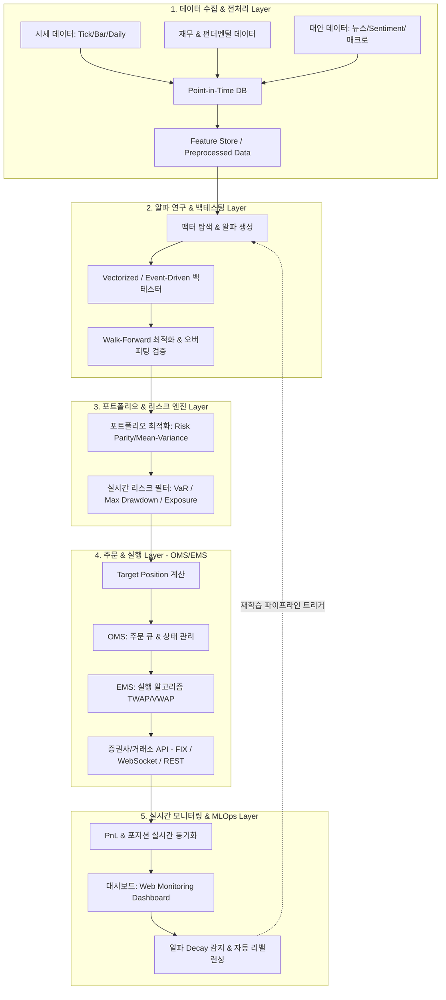

# 🚀 Quant Trading System Workflow Architecture


엔드투엔드(End-to-End) 자동화 퀀트 투자 및 알토 트레이딩 시스템의 통합 아키텍처 및 관제 웹 플랫폼입니다.  
데이터 수집부터 알파 발굴, 백테스팅, 포트폴리오 최적화, 주문 실행(OMS/EMS), 리스크 관리 및 실시간 관제 모듈까지 계층별로 체계화되어 있습니다.

---

## 📐 System Architecture Diagram



---

## ✨ Key Features

1. **Core Quant Engine (`quant_engine.py`)**
   - **Point-in-Time Data Generator**: Look-Ahead Bias 차단 데이터 시뮬레이션
   - **Alpha Signal Engine**: SMA Trend Momentum & RSI Mean-Reversion 알파 신호
   - **Vectorized Backtest Engine**: 슬리피지(Slippage) & 수수료 반영 백테스팅
   - **Risk Management**: Historical 95% VaR 산출 & MDD 손절 서킷브레이커
   - **OMS Execution Engine**: TWAP(Time-Weighted Average Price) 분할 주문 발주

2. **Interactive Web Monitoring Dashboard (`index.html`, `styles.css`, `app.js`)**
   - **Workflow Inspector**: 5단계 시스템 아키텍처 노드 및 기술 명세 시각화
   - **Backtest Studio**: 백테스트 조율 및 SVG 포트폴리오 수익률 곡선(Equity Curve) 그래프
   - **Risk Engine UI**: Portfolio Concentration, VaR %, 서킷브레이커 제어
   - **OMS Slicer Visualizer**: TWAP 분할 주문 실시간 진행률 워터폴
   - **Live Telemetry Terminal**: 실시간 시세 및 시스템 로그 콘솔

---

## 🛠️ Quick Start

### 1. Repository Clone
```bash
git clone https://github.com/YOUR_USERNAME/quant-system-workflow.git
cd quant-system-workflow
```

### 2. Python Core Engine 실행
```bash
python quant_engine.py
```

### 3. Web Dashboard 대시보드 구동
```bash
python -m http.server 8080
```
브라우저에서 `http://localhost:8080` 로 접속하여 인터랙티브 퀀트 웹 관제 대시보드를 확인합니다.

---

## 📁 Repository Directory Structure

```text
quant-system-workflow/
├── quant_engine.py     # 파이썬 퀀트 코어 엔진 (Data, Alpha, Backtest, Risk, OMS)
├── index.html          # 인터랙티브 웹 관제 대시보드 마크업
├── styles.css          # 고성능 Dark Glassmorphism CSS 디자인
├── app.js              # 실시간 차팅, 백테스터 시뮬레이터 및 OMS 제어 스크립트
├── .gitignore          # Git 제외 파일 정의
└── README.md           # 프로젝트 문서
```

---

## 📄 License

This project is licensed under the MIT License - see the [LICENSE](LICENSE) file for details.
